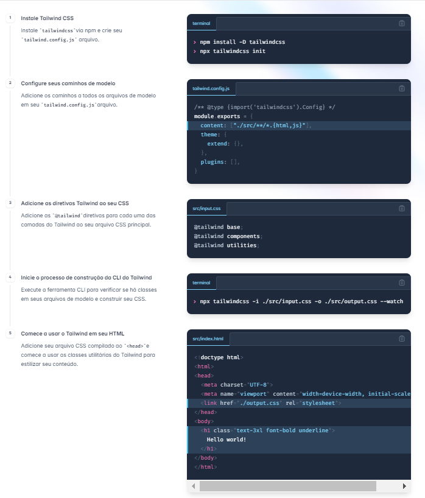
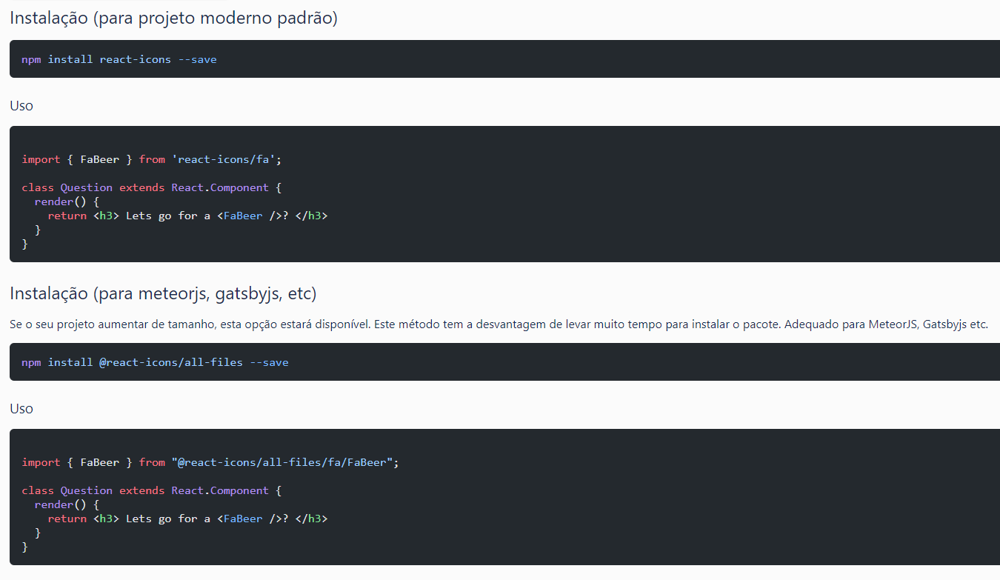
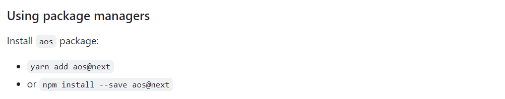
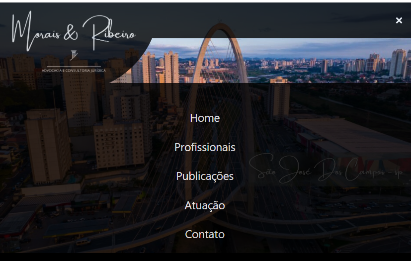

# React + Vite

This template provides a minimal setup to get React working in Vite with HMR and some ESLint rules.

Currently, two official plugins are available:

- [@vitejs/plugin-react](https://github.com/vitejs/vite-plugin-react/blob/main/packages/plugin-react/README.md) uses [Babel](https://babeljs.io/) for Fast Refresh
- [@vitejs/plugin-react-swc](https://github.com/vitejs/vite-plugin-react-swc) uses [SWC](https://swc.rs/) for Fast Refresh

-------------------------------------------------------------------------------
# Para criação do (Navbar) foi criado um componente utilizado as seguintes ferramentas: 

* https://tailwindcss.com/docs/installation

* https://react-icons.github.io/react-icons/

* https://michalsnik.github.io/aos/

* Resultado:

# No desenvolvimento criação da (Home) foi criado um componente utilizado as seguintes ferramentas: 

* Na criação do carousel de imagens foi utilizado boostrap via CDN

<link href="https://cdn.jsdelivr.net/npm/bootstrap@5.3.3/dist/css/bootstrap.min.css" rel="stylesheet" integrity="sha384-QWTKZyjpPEjISv5WaRU9OFeRpok6YctnYmDr5pNlyT2bRjXh0JMhjY6hW+ALEwIH" crossorigin="anonymous">

